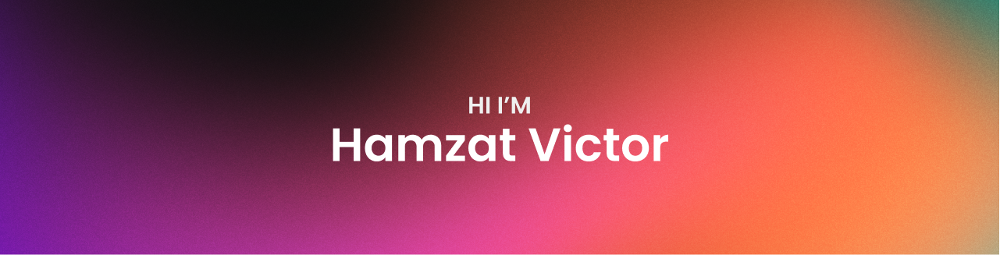

Hey there 👋

I’m Victor,a self-taught frontend developer based in Nigeria and I make the world a better place by building quality,consistent and fully accessible user interfaces with react.

Want to know more about me? [Check out my portfolio.](https://code-victor.github.io)

## 📝 Latest Blog Posts

- [Layout Animations with Framer motion](https://medium.com/p/25807bfc3750)

## &#x1f4c8; GitHub Stats

 

## 💼 Skills

Have a good day👍...

<!---
Code-Victor/Code-Victor is a ✨ special ✨ repository because its `README.md` (this file) appears on your GitHub profile.
You can click the Preview link to take a look at your changes.
--->
